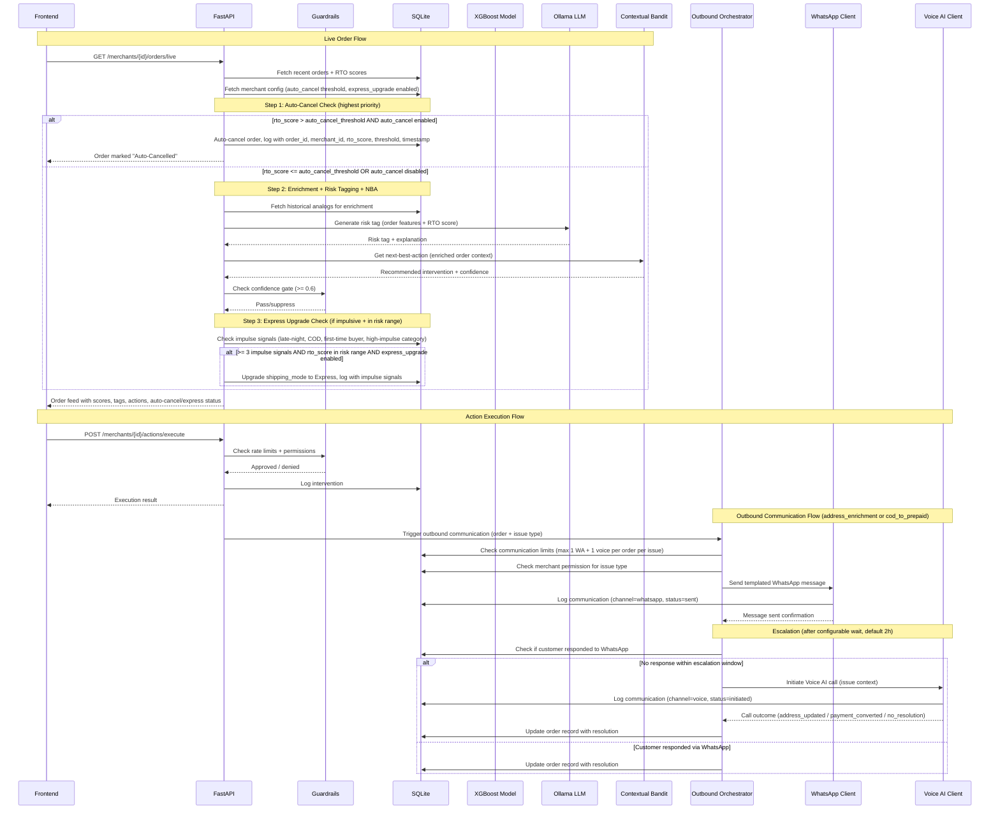
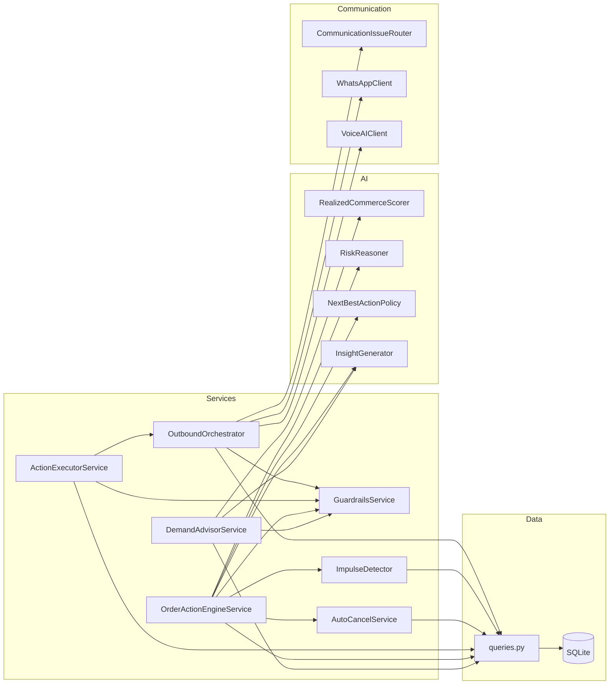

# Design Document: Delhivery Commerce AI

## Overview

Delhivery Commerce AI is a merchant-facing intelligence and decisioning layer built on top of Delhivery's existing RTO Predictor. The system has two connected modules:

1. **Demand Mix Advisor** — benchmarks a merchant's shipping cohorts against network peers and surfaces high-confidence suggestions for healthier demand acquisition.
2. **Order Action Engine** — consumes the existing RTO score, enriches it with merchant context, generates risk explanations, recommends the lowest-regret intervention via a learned policy, and routes execution to the correct owner.

3. **Outbound Communication** — proactively reaches out to customers on risky COD orders via WhatsApp (templated, no AI) and escalates to Voice AI calls when no response is received, resolving addressable issues before shipment.

4. **Auto-Cancel** — pure rule-based auto-cancellation of orders with extremely high RTO scores (above a configurable per-merchant threshold, default 0.9), gated by merchant opt-in. No AI involved.

5. **Express Upgrade for Impulsive Orders** — deterministic rule-based detection of impulsive buying patterns (late-night + COD + first-time buyer + high-impulse category) and automatic shipping upgrade from Surface to Express, gated by merchant opt-in. No AI involved.

The hackathon MVP delivers 4 screens: Merchant Snapshot, Demand Mix Advisor, Live Order Feed, and Action Console — all backed by a local SQLite database with 6–9 months of real anonymized order data. The outbound communication module runs as a background orchestrator that triggers WhatsApp messages and Voice AI escalation calls based on deterministic routing logic.

### Design Decisions

| Decision | Choice | Rationale |
|---|---|---|
| Local-first architecture | SQLite + FastAPI + Ollama | Zero external dependencies for hackathon demo. Everything runs on one machine. |
| Separate AI from deterministic logic | 5 AI touchpoints (scoring, risk reasoning, NBA, NL insights, voice AI), everything else rule-based | Auditability, debuggability, and trust. Merchants need to understand why actions are taken. |
| Contextual bandit over RL | scikit-learn / Vowpal Wabbit | Simpler to train on historical intervention-outcome data. No need for full RL exploration in MVP. |
| LLM via Ollama (Llama 3 / Mistral) | Local inference, no API keys | Hackathon constraint: no cloud dependencies. Ollama provides good-enough quality for explanation generation. |
| React over Streamlit for MVP | React (or Streamlit fallback) | React gives more control over the 4-screen layout. Streamlit is acceptable fallback if time is tight. |
| WhatsApp templates over AI-generated messages | Deterministic template selection from issue type | Customer-facing messages must be predictable, auditable, and pre-approved. No AI variability needed. |
| Voice AI for escalation calls | Bland.ai / Retell / Vocode | Voice calls require handling free-form customer responses — cannot be scripted with static IVR trees. |
| Only 2 communication issue types | address_enrichment, cod_to_prepaid | Focused on the two highest-value, clearly detectable issues. Only COD orders are eligible. |
| Deterministic routing for communication | Rule-based priority: address_enrichment > cod_to_prepaid | No AI needed — routing is a simple conditional on address_quality and destination_cluster RTO rate. |
| Auto-cancel as pure threshold check | rto_score > merchant auto_cancel_threshold (default 0.9) | RTO score already captures fraud/risk signal. A higher threshold than the general risk threshold ensures only extreme-risk orders are cancelled. No AI needed — it's a single comparison. |
| Express upgrade for impulsive orders | 3-of-4 impulse signals + RTO in risk range | All 4 signals (late-night, COD, first-time buyer, high-impulse category) are already in the order data or queryable from SQLite. Deterministic rule, no AI needed. |
| Order processing priority | Auto-cancel → Express upgrade → Standard NBA | Auto-cancel preempts everything (no point running NBA on a cancelled order). Express upgrade runs for orders in the risk-but-not-extreme zone. Standard NBA handles the rest. |

## Architecture

### High-Level Architecture

```mermaid
graph TB
    subgraph Frontend["Frontend (React / Streamlit)"]
        S1[Merchant Snapshot]
        S2[Demand Mix Advisor]
        S3[Live Order Feed]
        S4[Action Console]
    end

    subgraph API["FastAPI Backend"]
        R1[/merchants/{id}/snapshot/]
        R2[/merchants/{id}/demand-suggestions/]
        R3[/merchants/{id}/orders/live/]
        R4[/merchants/{id}/actions/]
        R5[/merchants/{id}/dashboard/]
        R6[/merchants/{id}/communications/]
        GR[Guardrails Middleware]
    end

    subgraph AI["AI Layer"]
        M1[Realized Commerce Score Model<br/>XGBoost]
        M2[Risk Reasoning + Tagging<br/>LangChain + LLM]
        M3[Next-Best-Action Policy<br/>Contextual Bandit]
        M4[NL Insight Generator<br/>LangChain + LLM]
        M5[Voice AI Engine<br/>Bland.ai / Retell / Vocode]
    end

    subgraph Communication["Communication Layer"]
        OO[Outbound Orchestrator]
        WA[WhatsApp Client<br/>Templated Messages]
        VA[Voice AI Client]
    end

    subgraph RuleBased["Rule-Based Services"]
        AC[Auto-Cancel Service]
        ID[Impulse Detector]
    end

    subgraph Data["Data Layer"]
        DB[(SQLite)]
        OL[Ollama Server<br/>Llama 3 / Mistral]
    end

    S1 --> R1
    S2 --> R2
    S3 --> R3
    S4 --> R4

    R1 --> DB
    R2 --> M1
    R2 --> M4
    R3 --> M2
    R3 --> M3
    R4 --> GR
    R6 --> OO
    GR --> DB

    AC --> DB
    ID --> DB

    OO --> WA
    OO --> VA
    OO --> DB
    VA --> M5
    WA --> DB

    M1 --> DB
    M2 --> OL
    M3 --> DB
    M4 --> OL
```

### Request Flow




## Components and Interfaces

### 1. Data Layer (`data/`)

#### `db.py` — Database Connection and Schema

```python
# SQLite connection manager + schema definition
# Tables: merchants, orders, cohorts, interventions, peer_benchmarks, merchant_permissions

def get_db() -> sqlite3.Connection
def init_db(db_path: str) -> None
def load_data_from_csv(db: Connection, csv_dir: str) -> None
```

#### `queries.py` — Query Functions (All Deterministic)

```python
def get_merchant_snapshot(db, merchant_id: str) -> MerchantSnapshot
def get_cohort_benchmarks(db, merchant_id: str) -> list[CohortBenchmark]
def get_peer_benchmarks(db, merchant_id: str, cohort: CohortKey) -> PeerBenchmark
def get_recent_orders(db, merchant_id: str, limit: int = 50) -> list[Order]
def get_historical_analogs(db, cohort: CohortKey, min_orders: int = 50) -> list[Order]
def get_intervention_history(db, merchant_id: str, period_days: int) -> list[InterventionLog]
def get_intervention_counts(db, merchant_id: str) -> InterventionCounts
def check_rate_limits(db, merchant_id: str) -> RateLimitStatus
def log_intervention(db, intervention: InterventionLog) -> None
def get_merchant_permissions(db, merchant_id: str) -> MerchantPermissions
```

### 2. AI Layer (`ai/`)

#### `scoring.py` — Realized Commerce Score (XGBoost)

```python
class RealizedCommerceScorer:
    def __init__(self, model_path: str)
    def train(self, orders: pd.DataFrame) -> None
    def predict(self, cohort_features: CohortFeatures) -> float  # Returns 0-1 score
    def rank_cohorts(self, merchant_id: str, cohorts: list[CohortFeatures]) -> list[ScoredCohort]
    def is_low_confidence(self, cohort: CohortFeatures, min_orders: int = 50) -> bool
```

#### `risk_reasoning.py` — RTO Risk Tagging (LangChain + LLM)

```python
class RiskReasoner:
    def __init__(self, ollama_model: str = "llama3")
    def generate_risk_tag(self, order: EnrichedOrder) -> RiskTag
    # RiskTag contains: tag_label (str), explanation (str)
    # Input: order features + RTO score + historical analog stats
```

#### `next_best_action.py` — Contextual Bandit Policy

```python
class NextBestActionPolicy:
    def __init__(self, model_path: str)
    def train(self, intervention_outcomes: pd.DataFrame) -> None
    def recommend(self, order_context: OrderContext) -> ActionRecommendation
    # ActionRecommendation: intervention_type, confidence_score (0-1)
    # Interventions: verification, cancellation, masked_calling,
    #   cod_to_prepaid, premium_courier, merchant_confirmation,
    #   address_enrichment_outreach, cod_to_prepaid_outreach, no_action
```

#### `insights.py` — NL Insight Generator (LangChain + LLM)

```python
class InsightGenerator:
    def __init__(self, ollama_model: str = "llama3")
    def generate_demand_insight(self, suggestion: DemandSuggestion) -> str
    def generate_action_insight(self, order: EnrichedOrder, action: ActionRecommendation) -> str
    # Both return plain-language explanations referencing specific data points
```

### 3. Business Logic Layer (`services/`)

#### `demand_advisor.py` — Demand Mix Advisor Service

```python
class DemandAdvisorService:
    def __init__(self, db, scorer: RealizedCommerceScorer, insight_gen: InsightGenerator)
    def get_suggestions(self, merchant_id: str) -> list[DemandSuggestion]
    # Orchestrates: peer benchmark lookup → scoring → confidence gating → NL insight
    # Returns 1-5 suggestions, ranked by expected score improvement
    # Applies confidence gate: min 200 peer orders, CI width < 15pp
```

#### `order_engine.py` — Order Action Engine Service

```python
class OrderActionEngineService:
    def __init__(self, db, risk_reasoner: RiskReasoner, nba_policy: NextBestActionPolicy,
                 insight_gen: InsightGenerator, auto_cancel_service: AutoCancelService,
                 impulse_detector: ImpulseDetector)
    def process_order(self, order: Order, merchant_config: MerchantPermissions) -> ProcessedOrder
    # Order processing priority:
    # Step 1: Auto-cancel check — if rto_score > auto_cancel_threshold AND auto_cancel enabled → cancel, stop
    # Step 2: Standard flow — enrichment → risk tagging → NBA → confidence gate
    # Step 3: Express upgrade check — if impulsive AND express_upgrade enabled AND rto_score in risk range → upgrade
    # Auto-cancel preempts everything. Express upgrade runs alongside NBA (doesn't replace it).
    def get_live_feed(self, merchant_id: str) -> list[ProcessedOrder]
    # Returns orders sorted by RTO score descending
```

#### `action_executor.py` — Action Execution Service

```python
class ActionExecutorService:
    def __init__(self, db)
    def execute(self, merchant_id: str, order_id: str, intervention: InterventionType) -> ExecutionResult
    # Checks: permissions → rate limits → execute → log → return result
    def categorize_action(self, intervention: InterventionType) -> ActionOwner  # "delhivery" | "merchant"
    def retry_failed(self, intervention_log_id: str) -> ExecutionResult
```

#### `guardrails.py` — Guardrails and Confidence Gating

```python
class GuardrailsService:
    def __init__(self, db)
    def check_rate_limit(self, merchant_id: str) -> bool  # True if within limits
    def check_permission(self, merchant_id: str, intervention_type: InterventionType) -> bool
    def apply_confidence_gate(self, recommendation, gate_type: str) -> bool
    # gate_type: "demand" (200 peer orders, CI < 15pp) or "action" (confidence >= 0.6)
    def log_suppression(self, recommendation, reason: str) -> None
```

#### `auto_cancel.py` — Auto-Cancel Service (No AI, Pure Rule-Based)

```python
class AutoCancelResult(BaseModel):
    cancelled: bool
    reason: str                        # "rto_score_exceeded_threshold" or "auto_cancel_disabled" or "below_threshold"
    order_id: str
    merchant_id: str
    rto_score: float
    threshold: float
    cancelled_at: datetime | None

class AutoCancelService:
    def __init__(self, db)
    def check_and_cancel(self, order: Order, merchant_config: MerchantPermissions) -> AutoCancelResult
    # Pure threshold check:
    # 1. If merchant has NOT enabled auto_cancel → return cancelled=False, reason="auto_cancel_disabled"
    # 2. If order.rto_score <= merchant auto_cancel_threshold → return cancelled=False, reason="below_threshold"
    # 3. If order.rto_score > threshold AND enabled → cancel order, log, return cancelled=True
    # Logs: order_id, merchant_id, rto_score, threshold, timestamp
```

#### `impulse_detector.py` — Impulse Detection and Express Upgrade (No AI, Deterministic)

```python
class ImpulseSignal(str, Enum):
    LATE_NIGHT = "late_night"          # created_at between 23:00 and 04:00
    COD_PAYMENT = "cod_payment"        # payment_mode == COD
    FIRST_TIME_BUYER = "first_time_buyer"  # no prior delivered orders
    HIGH_IMPULSE_CATEGORY = "high_impulse_category"  # fashion, beauty (configurable)

class ImpulseResult(BaseModel):
    is_impulsive: bool
    matched_signals: list[ImpulseSignal]
    signal_count: int
    order_id: str
    rto_score: float

class ExpressUpgradeResult(BaseModel):
    upgraded: bool
    reason: str                        # "impulsive_and_enabled", "not_impulsive", "express_upgrade_disabled", "outside_risk_range"
    order_id: str
    merchant_id: str
    rto_score: float
    matched_signals: list[ImpulseSignal]
    original_shipping_mode: str        # "surface"
    new_shipping_mode: str | None      # "express" if upgraded, None otherwise
    upgraded_at: datetime | None

class ImpulseDetector:
    def __init__(self, db, impulse_categories: list[str] = ["fashion", "beauty"])
    def detect(self, order: Order, merchant_history: list[Order]) -> ImpulseResult
    # Checks 4 signals:
    # 1. Late-night: order.created_at.hour in {23, 0, 1, 2, 3}
    # 2. COD: order.payment_mode == PaymentMode.COD
    # 3. First-time buyer: no order in merchant_history with same customer_ucid and delivery_outcome == "delivered"
    # 4. High-impulse category: order.category in impulse_categories
    # Returns is_impulsive=True if signal_count >= 3
    def upgrade_to_express(self, order: Order, merchant_config: MerchantPermissions,
                           impulse_result: ImpulseResult, risk_threshold: float,
                           auto_cancel_threshold: float) -> ExpressUpgradeResult
    # Only triggers when:
    # 1. impulse_result.is_impulsive == True
    # 2. order.rto_score > risk_threshold (above general risk)
    # 3. order.rto_score <= auto_cancel_threshold (below auto-cancel)
    # 4. merchant has enabled express_upgrade
    # If all conditions met: upgrade shipping_mode from "surface" to "express", log
    # If not enabled: return upgraded=False (impulsive flag shown as informational tag only)
```

### 6. Communication Layer (`communication/`)

#### `whatsapp_client.py` — WhatsApp Templated Messaging (No AI)

```python
class WhatsAppClient:
    def __init__(self, api_base_url: str, api_token: str)
    def send_template_message(self, customer_ucid: str, issue_type: CommunicationIssueType, template_fields: dict) -> WhatsAppSendResult
    # Selects pre-defined template based on issue_type, populates dynamic fields
    # Returns: message_id, status (sent/failed), error_message
    def check_response(self, message_id: str) -> WhatsAppResponseStatus
    # Returns: responded (bool), response_content (str | None), responded_at (datetime | None)
```

#### `voice_ai_client.py` — Voice AI Escalation (AI-Powered)

```python
class VoiceAIClient:
    def __init__(self, provider: str, api_key: str)  # provider: "bland", "retell", "vocode"
    def initiate_call(self, customer_ucid: str, issue_type: CommunicationIssueType, call_context: VoiceCallContext) -> VoiceCallResult
    # AI handles free-form dialogue based on issue context
    # Returns: call_id, status (completed/failed/no_answer), resolution, transcript_summary
    def get_call_status(self, call_id: str) -> VoiceCallStatus
```

#### `issue_router.py` — Deterministic Communication Issue Routing (No AI)

```python
class CommunicationIssueRouter:
    def __init__(self, address_quality_threshold: float = 0.5, cluster_rto_threshold: float = 0.3)
    def route(self, order: Order, cluster_rto_rate: float) -> CommunicationIssueType | None
    # Deterministic routing logic:
    # 1. Only COD orders are eligible (prepaid → None)
    # 2. IF address_quality < threshold → address_enrichment
    # 3. ELIF cluster COD-RTO rate > cluster_threshold → cod_to_prepaid
    # 4. ELSE → None (no outbound communication needed)
    # Address enrichment takes precedence when both conditions are true
    def get_template_fields(self, order: Order, issue_type: CommunicationIssueType) -> dict
    # Returns dynamic fields for the WhatsApp template based on issue type
```

### 7. Outbound Orchestrator (`services/outbound_orchestrator.py`)

```python
class OutboundOrchestrator:
    def __init__(self, db, whatsapp_client: WhatsAppClient, voice_ai_client: VoiceAIClient,
                 issue_router: CommunicationIssueRouter, escalation_window_hours: float = 2.0)
    def trigger_outbound(self, order: Order, issue_type: CommunicationIssueType) -> CommunicationLog
    # Full flow: check limits → check permission → send WhatsApp → log → schedule escalation check
    def check_and_escalate(self, communication_log_id: str) -> CommunicationLog
    # Called after escalation_window: if no WA response → initiate voice AI call → log → update order
    def update_order_resolution(self, order_id: str, resolution: CommunicationResolution) -> None
    # Updates order record with resolution outcome
    def get_communication_status(self, order_id: str) -> list[CommunicationLog]
    # Returns all communication logs for an order
    def check_communication_limits(self, order_id: str, issue_type: CommunicationIssueType) -> bool
    # Enforces max 1 WA + 1 voice per order per issue type
    def fallback_to_next_intervention(self, order_id: str) -> None
    # When both WA and voice fail: mark no_response, trigger next-best non-communication intervention
```

### 4. API Layer (`api/`)

#### `routes.py` — FastAPI Endpoints

| Endpoint | Method | Description | AI? |
|---|---|---|---|
| `/merchants/{id}/snapshot` | GET | Merchant snapshot with benchmarks | No |
| `/merchants/{id}/demand-suggestions` | GET | Demand Mix Advisor suggestions | Yes (scoring + NL) |
| `/merchants/{id}/orders/live` | GET | Live order feed with risk tags + NBA | Yes (risk + bandit + NL) |
| `/merchants/{id}/actions/execute` | POST | Execute an intervention | No |
| `/merchants/{id}/actions/log` | GET | Intervention history | No |
| `/merchants/{id}/dashboard` | GET | Dashboard metrics and trends | No |
| `/merchants/{id}/permissions` | GET/PUT | Merchant permission config | No |
| `/merchants/{id}/communications/status` | GET | Communication status for merchant's orders | No |
| `/orders/{order_id}/communications` | GET | Communication logs for a specific order | No |
| `/orders/{order_id}/communications/trigger` | POST | Manually trigger outbound communication | No (routing) + Yes (voice AI if escalated) |

### 5. Frontend (`frontend/`)

Four screens, each mapping to one or more API endpoints:

| Screen | Primary Endpoint | Key Components |
|---|---|---|
| Merchant Snapshot | `/snapshot` | Warehouse node map, category-price heatmap, benchmark gap bars |
| Demand Mix Advisor | `/demand-suggestions` | Suggestion cards with NL explanations, score improvement indicators |
| Live Order Feed | `/orders/live` | Sortable table: order ID, RTO score, risk tag, NBA, confidence, communication status, auto-cancel status, impulse flags, express upgrade status |
| Action Console | `/actions/execute` + `/actions/log` + `/communications/status` | Two-column layout: Delhivery-executable vs merchant-owned, outbound communication status per order, auto-cancelled orders section, express-upgraded orders section, execution status |

### Component Interaction Diagram



## Data Models

### SQLite Schema

```sql
-- Merchant metadata
CREATE TABLE merchants (
    merchant_id TEXT PRIMARY KEY,
    name TEXT NOT NULL,
    created_at TIMESTAMP DEFAULT CURRENT_TIMESTAMP
);

-- Merchant warehouse nodes
CREATE TABLE warehouse_nodes (
    node_id TEXT PRIMARY KEY,
    merchant_id TEXT NOT NULL REFERENCES merchants(merchant_id),
    city TEXT NOT NULL,
    state TEXT NOT NULL,
    pincode TEXT NOT NULL,
    is_active BOOLEAN DEFAULT TRUE
);

-- Order data (6-9 months historical)
CREATE TABLE orders (
    order_id TEXT PRIMARY KEY,
    merchant_id TEXT NOT NULL REFERENCES merchants(merchant_id),
    customer_ucid TEXT NOT NULL,        -- unique identifier for customer phone number
    category TEXT NOT NULL,
    price_band TEXT NOT NULL,          -- e.g., "0-500", "500-1000", "1000-2000", "2000+"
    payment_mode TEXT NOT NULL,         -- "COD" or "prepaid"
    origin_node TEXT NOT NULL REFERENCES warehouse_nodes(node_id),
    destination_pincode TEXT NOT NULL,
    destination_cluster TEXT NOT NULL,  -- geographic grouping
    address_quality REAL NOT NULL,      -- 0-1 score
    rto_score REAL NOT NULL,            -- 0-1 from existing RTO Predictor
    delivery_outcome TEXT NOT NULL,     -- "delivered", "rto", "pending"
    shipping_mode TEXT NOT NULL DEFAULT 'surface',  -- "surface" or "express"
    created_at TIMESTAMP NOT NULL
);

-- Intervention history
CREATE TABLE interventions (
    intervention_id TEXT PRIMARY KEY,
    order_id TEXT NOT NULL REFERENCES orders(order_id),
    merchant_id TEXT NOT NULL REFERENCES merchants(merchant_id),
    intervention_type TEXT NOT NULL,    -- verification, cancellation, masked_calling,
                                       -- cod_to_prepaid, premium_courier, merchant_confirmation,
                                       -- address_enrichment_outreach, cod_to_prepaid_outreach,
                                       -- auto_cancel, express_upgrade, no_action
    action_owner TEXT NOT NULL,         -- "delhivery" or "merchant"
    initiated_by TEXT NOT NULL,         -- "system" or "merchant"
    confidence_score REAL,
    outcome TEXT,                       -- "successful_delivery", "rto", "pending", "failed"
    executed_at TIMESTAMP NOT NULL,
    completed_at TIMESTAMP
);

-- Outbound communication logs
CREATE TABLE communication_logs (
    communication_id TEXT PRIMARY KEY,
    order_id TEXT NOT NULL REFERENCES orders(order_id),
    merchant_id TEXT NOT NULL REFERENCES merchants(merchant_id),
    customer_ucid TEXT NOT NULL,
    issue_type TEXT NOT NULL,           -- "address_enrichment" or "cod_to_prepaid"
    channel TEXT NOT NULL,              -- "whatsapp" or "voice"
    template_id TEXT,                   -- WhatsApp template identifier (null for voice)
    message_id TEXT,                    -- External message/call ID from provider
    status TEXT NOT NULL,               -- "sent", "delivered", "responded", "failed", "no_response",
                                       -- "call_initiated", "call_completed", "call_failed", "call_no_answer"
    customer_response TEXT,             -- Customer's response content (if any)
    resolution TEXT,                    -- "address_updated", "payment_converted", "no_resolution", null
    sent_at TIMESTAMP NOT NULL,
    responded_at TIMESTAMP,
    escalation_scheduled_at TIMESTAMP,  -- When voice escalation is scheduled
    created_at TIMESTAMP DEFAULT CURRENT_TIMESTAMP
);

-- Merchant permissions for automated interventions
CREATE TABLE merchant_permissions (
    merchant_id TEXT NOT NULL REFERENCES merchants(merchant_id),
    intervention_type TEXT NOT NULL,
    is_enabled BOOLEAN DEFAULT FALSE,
    daily_cap INTEGER DEFAULT 500,
    hourly_cap INTEGER DEFAULT 100,
    auto_cancel_enabled BOOLEAN DEFAULT FALSE,
    auto_cancel_threshold REAL DEFAULT 0.9,  -- Must be > general risk threshold
    express_upgrade_enabled BOOLEAN DEFAULT FALSE,
    impulse_categories TEXT DEFAULT 'fashion,beauty',  -- Comma-separated configurable list
    PRIMARY KEY (merchant_id, intervention_type)
);

-- Suppressed recommendations audit log
CREATE TABLE suppressed_recommendations (
    id INTEGER PRIMARY KEY AUTOINCREMENT,
    merchant_id TEXT NOT NULL,
    recommendation_type TEXT NOT NULL,  -- "demand_suggestion" or "next_best_action"
    recommendation_data TEXT NOT NULL,  -- JSON blob
    suppression_reason TEXT NOT NULL,   -- "insufficient_sample_size" or "low_signal_quality"
    suppressed_at TIMESTAMP DEFAULT CURRENT_TIMESTAMP
);
```

### Python Data Models (Pydantic)

```python
from pydantic import BaseModel
from enum import Enum
from datetime import datetime

# --- Enums ---

class PaymentMode(str, Enum):
    COD = "COD"
    PREPAID = "prepaid"

class DeliveryOutcome(str, Enum):
    DELIVERED = "delivered"
    RTO = "rto"
    PENDING = "pending"

class InterventionType(str, Enum):
    VERIFICATION = "verification"
    CANCELLATION = "cancellation"
    MASKED_CALLING = "masked_calling"
    COD_TO_PREPAID = "cod_to_prepaid"
    PREMIUM_COURIER = "premium_courier"
    MERCHANT_CONFIRMATION = "merchant_confirmation"
    ADDRESS_ENRICHMENT_OUTREACH = "address_enrichment_outreach"
    COD_TO_PREPAID_OUTREACH = "cod_to_prepaid_outreach"
    AUTO_CANCEL = "auto_cancel"
    EXPRESS_UPGRADE = "express_upgrade"
    NO_ACTION = "no_action"

class ActionOwner(str, Enum):
    DELHIVERY = "delhivery"
    MERCHANT = "merchant"

class CommunicationIssueType(str, Enum):
    ADDRESS_ENRICHMENT = "address_enrichment"
    COD_TO_PREPAID = "cod_to_prepaid"

class CommunicationChannel(str, Enum):
    WHATSAPP = "whatsapp"
    VOICE = "voice"

class CommunicationStatus(str, Enum):
    SENT = "sent"
    DELIVERED = "delivered"
    RESPONDED = "responded"
    FAILED = "failed"
    NO_RESPONSE = "no_response"
    CALL_INITIATED = "call_initiated"
    CALL_COMPLETED = "call_completed"
    CALL_FAILED = "call_failed"
    CALL_NO_ANSWER = "call_no_answer"

class CommunicationResolution(str, Enum):
    ADDRESS_UPDATED = "address_updated"
    PAYMENT_CONVERTED = "payment_converted"
    NO_RESOLUTION = "no_resolution"

# --- Core Models ---

class CohortKey(BaseModel):
    category: str
    price_band: str
    payment_mode: PaymentMode
    origin_node: str
    destination_cluster: str

class Order(BaseModel):
    order_id: str
    merchant_id: str
    customer_ucid: str  # unique identifier for customer phone number
    category: str
    price_band: str
    payment_mode: PaymentMode
    origin_node: str
    destination_pincode: str
    destination_cluster: str
    address_quality: float  # 0-1
    rto_score: float        # 0-1
    delivery_outcome: DeliveryOutcome
    shipping_mode: str = "surface"  # "surface" or "express"
    created_at: datetime

class EnrichedOrder(BaseModel):
    order: Order
    historical_rto_rate: float       # RTO rate for similar cohort
    historical_sample_size: int
    peer_avg_rto_rate: float

class RiskTag(BaseModel):
    tag_label: str
    explanation: str

class ActionRecommendation(BaseModel):
    intervention_type: InterventionType
    confidence_score: float  # 0-1
    explanation: str

class ProcessedOrder(BaseModel):
    order: Order
    enrichment: EnrichedOrder
    risk_tag: RiskTag | None          # None if below risk threshold
    next_best_action: ActionRecommendation | None  # None if gated
    nl_explanation: str | None
    auto_cancel_result: AutoCancelResult | None  # None if auto-cancel not applicable
    impulse_result: ImpulseResult | None          # None if not evaluated
    express_upgrade_result: ExpressUpgradeResult | None  # None if not applicable

class ScoredCohort(BaseModel):
    cohort_key: CohortKey
    realized_commerce_score: float  # 0-1
    is_low_confidence: bool
    order_count: int

class PeerBenchmark(BaseModel):
    cohort_key: CohortKey
    merchant_score: float
    peer_avg_score: float
    peer_sample_size: int
    confidence_interval_width: float  # percentage points
    gap: float  # merchant_score - peer_avg_score

class DemandSuggestion(BaseModel):
    cohort_dimension: str             # "destination_cluster", "payment_mode", "pincode_group"
    recommended_value: str            # e.g., "Mumbai cluster", "prepaid"
    expected_score_improvement: float
    peer_benchmark: PeerBenchmark
    nl_explanation: str

class MerchantSnapshot(BaseModel):
    merchant_id: str
    warehouse_nodes: list[dict]       # node_id, city, state, pincode
    category_distribution: dict       # category -> order_count
    price_band_distribution: dict     # price_band -> order_count
    payment_mode_distribution: dict   # payment_mode -> order_count
    benchmark_gaps: list[PeerBenchmark]

class InterventionLog(BaseModel):
    intervention_id: str
    order_id: str
    merchant_id: str
    intervention_type: InterventionType
    action_owner: ActionOwner
    initiated_by: str
    confidence_score: float | None
    outcome: str | None
    executed_at: datetime
    completed_at: datetime | None

class ExecutionResult(BaseModel):
    success: bool
    intervention_log_id: str
    error_message: str | None

class RateLimitStatus(BaseModel):
    daily_used: int
    daily_cap: int
    hourly_used: int
    hourly_cap: int
    is_within_limits: bool

class MerchantPermissions(BaseModel):
    merchant_id: str
    permissions: dict[InterventionType, bool]
    daily_cap: int
    hourly_cap: int
    auto_cancel_enabled: bool = False
    auto_cancel_threshold: float = 0.9  # Must be > general risk threshold
    express_upgrade_enabled: bool = False
    impulse_categories: list[str] = ["fashion", "beauty"]  # Configurable per merchant

# --- Action Categorization (static mapping, no AI) ---

DELHIVERY_EXECUTABLE = {
    InterventionType.VERIFICATION,
    InterventionType.CANCELLATION,
    InterventionType.MASKED_CALLING,
    InterventionType.PREMIUM_COURIER,
    InterventionType.ADDRESS_ENRICHMENT_OUTREACH,   # Delhivery sends these directly to customer
    InterventionType.COD_TO_PREPAID_OUTREACH,        # Delhivery sends these directly to customer
    InterventionType.AUTO_CANCEL,                    # Delhivery auto-cancels extreme-risk orders
    InterventionType.EXPRESS_UPGRADE,                # Delhivery upgrades shipping for impulsive orders
}

MERCHANT_OWNED = {
    InterventionType.MERCHANT_CONFIRMATION,
}

# --- Communication Models ---

class WhatsAppSendResult(BaseModel):
    message_id: str
    status: str  # "sent" or "failed"
    error_message: str | None

class WhatsAppResponseStatus(BaseModel):
    responded: bool
    response_content: str | None
    responded_at: datetime | None

class VoiceCallContext(BaseModel):
    order_id: str
    customer_ucid: str
    issue_type: CommunicationIssueType
    current_address: str | None         # For address_enrichment
    payment_link_url: str | None        # For cod_to_prepaid
    order_summary: dict                 # Order details for voice AI context

class VoiceCallResult(BaseModel):
    call_id: str
    status: str  # "completed", "failed", "no_answer"
    resolution: CommunicationResolution | None
    transcript_summary: str | None

class VoiceCallStatus(BaseModel):
    call_id: str
    status: str
    duration_seconds: int | None
    resolution: CommunicationResolution | None

class CommunicationLog(BaseModel):
    communication_id: str
    order_id: str
    merchant_id: str
    customer_ucid: str
    issue_type: CommunicationIssueType
    channel: CommunicationChannel
    template_id: str | None
    message_id: str | None
    status: CommunicationStatus
    customer_response: str | None
    resolution: CommunicationResolution | None
    sent_at: datetime
    responded_at: datetime | None
    escalation_scheduled_at: datetime | None
```

## Correctness Properties

*A property is a characteristic or behavior that should hold true across all valid executions of a system — essentially, a formal statement about what the system should do. Properties serve as the bridge between human-readable specifications and machine-verifiable correctness guarantees.*

### Property 1: Merchant snapshot completeness

*For any* merchant with orders in the database, the merchant snapshot response SHALL contain: a non-empty list of active warehouse nodes, a category distribution covering all categories present in the merchant's orders, a price band distribution, a payment mode distribution, and peer benchmark gaps for each of the 5 cohort dimensions (category, price band, payment mode, origin node, destination cluster).

**Validates: Requirements 1.1, 1.2**

### Property 2: Realized Commerce Score range invariant

*For any* valid cohort features (valid category, price band, payment mode, origin node, destination cluster, and address quality in [0,1]), the Realized Commerce Score model SHALL return a score in the range [0, 1].

**Validates: Requirements 2.1**

### Property 3: Cohort ranking is sorted descending

*For any* merchant, the list of scored cohorts returned by `rank_cohorts` SHALL be sorted in descending order of Realized Commerce Score — that is, for every consecutive pair (i, i+1), `score[i] >= score[i+1]`.

**Validates: Requirements 2.2**

### Property 4: Low-confidence flagging threshold

*For any* cohort, `is_low_confidence` SHALL be True if and only if the cohort has fewer than 50 historical orders on the Delhivery network.

**Validates: Requirements 2.4**

### Property 5: Demand suggestion count, ranking, and structure

*For any* merchant with sufficient data, the Demand Mix Advisor SHALL return between 1 and 5 suggestions (inclusive). Each suggestion SHALL contain a non-empty `cohort_dimension`, a positive `expected_score_improvement`, a non-null `peer_benchmark` reference, and a non-empty `nl_explanation`. The suggestions SHALL be sorted in descending order of `expected_score_improvement`.

**Validates: Requirements 3.1, 3.3**

### Property 6: Confidence gating for all recommendations

*For any* demand suggestion surfaced to a merchant, the supporting peer benchmark sample size SHALL be >= 200 AND the confidence interval width SHALL be <= 15 percentage points. *For any* next-best-action recommendation surfaced to a merchant, the historical analog order count SHALL be >= 50. Any recommendation failing these thresholds SHALL be suppressed from the merchant-facing interface.

**Validates: Requirements 3.4, 9.2, 9.3**

### Property 7: Natural-language insights reference specific data points

*For any* generated natural-language insight (whether for a demand suggestion or an action recommendation), the text SHALL contain at least one specific numeric value (score, percentage, or count) and at least one cohort dimension name (category, price band, payment mode, destination cluster, or origin node).

**Validates: Requirements 4.1, 4.2, 4.4**

### Property 8: Order enrichment preserves RTO score and adds context

*For any* order processed by the Order Action Engine, the enriched order SHALL preserve the original `rto_score` value unchanged AND SHALL contain non-null `historical_rto_rate`, `historical_sample_size`, and `peer_avg_rto_rate` fields.

**Validates: Requirements 5.1, 5.2**

### Property 9: Risk threshold triggers both risk tag and next-best-action

*For any* order whose RTO score exceeds the configurable risk threshold, the system SHALL generate both a non-null `RiskTag` (with non-empty `tag_label` and `explanation`) and a non-null `ActionRecommendation`. *For any* order whose RTO score is at or below the threshold, both SHALL be null.

**Validates: Requirements 5.3, 6.1**

### Property 10: Live order feed sorted by RTO score descending

*For any* merchant's live order feed, the orders SHALL be sorted by RTO score in descending order — for every consecutive pair (i, i+1), `rto_score[i] >= rto_score[i+1]`.

**Validates: Requirements 5.5**

### Property 11: NBA confidence score range invariant

*For any* next-best-action recommendation, the `confidence_score` SHALL be in the range [0, 1].

**Validates: Requirements 6.3**

### Property 12: Low-confidence NBA defaults to no_action

*For any* next-best-action recommendation where the confidence score is below 0.6, the `intervention_type` SHALL be `no_action`.

**Validates: Requirements 6.4**

### Property 13: Action categorization matches static mapping

*For any* intervention type, `categorize_action` SHALL return `"delhivery"` for verification, cancellation, masked_calling, premium_courier, address_enrichment_outreach, cod_to_prepaid_outreach, auto_cancel, and express_upgrade; and SHALL return `"merchant"` for merchant_confirmation. This mapping SHALL be exhaustive over all InterventionType values except no_action.

**Validates: Requirements 7.1, 12.1**

### Property 14: Intervention logging completeness

*For any* intervention execution (successful or failed), the resulting log entry SHALL contain a non-null timestamp, order identifier, intervention type, initiating party (delhivery or merchant), and outcome field.

**Validates: Requirements 7.4**

### Property 15: Failed intervention retry

*For any* Delhivery-executable intervention that fails during execution, the system SHALL automatically retry exactly once. After the retry, the log SHALL contain exactly 2 entries for that order-intervention pair.

**Validates: Requirements 7.5**

### Property 16: Rate limit enforcement

*For any* merchant, the number of automated interventions executed SHALL NOT exceed the configured daily cap (default 500) in any 24-hour period, AND SHALL NOT exceed the configured hourly cap (default 100) in any 1-hour period. When either cap is reached, subsequent interventions SHALL be queued rather than executed.

**Validates: Requirements 8.1, 8.2, 8.3**

### Property 17: Permission enforcement

*For any* intervention execution attempt or outbound communication attempt, if the merchant has not granted explicit permission for that intervention type or communication issue type, the system SHALL NOT execute the intervention or send the communication. The recommendation SHALL be presented as a suggestion only.

**Validates: Requirements 8.4, 8.5, 12.8**

### Property 18: Suppression audit logging

*For any* recommendation suppressed by the Confidence Gate, a log entry SHALL be created containing the merchant ID, recommendation type, recommendation data, and the specific suppression reason (insufficient sample size or low signal quality).

**Validates: Requirements 9.4**

### Property 19: Dashboard filter correctness

*For any* filter applied to the dashboard (by category, price band, payment mode, origin node, or destination cluster), all returned metrics and data points SHALL correspond exclusively to orders matching the applied filter criteria.

**Validates: Requirements 10.3**

### Property 20: Intervention count aggregation correctness

*For any* time period selection, the displayed intervention counts grouped by type and outcome SHALL equal the sum of individual intervention log entries matching that type, outcome, and time period.

**Validates: Requirements 10.4**

### Property 21: Order data completeness

*For any* order record in the database, all required fields SHALL be non-null: merchant_id, customer_ucid, category, price_band, payment_mode, origin_node, destination_pincode, destination_cluster, address_quality, rto_score, delivery_outcome, and created_at.

**Validates: Requirements 11.2**

### Property 22: Data loading round trip

*For any* valid CSV/JSON source file containing order records, loading the data via the data loading script and then querying the database SHALL return records with field values identical to the source file.

**Validates: Requirements 11.3**

### Property 23: Communication issue routing determinism

*For any* order, the communication issue router SHALL return: `None` if the order is prepaid; `address_enrichment` if the order is COD and `address_quality < threshold`; `cod_to_prepaid` if the order is COD, `address_quality >= threshold`, and the destination cluster COD-RTO rate exceeds the cluster threshold; and `None` otherwise. When both conditions are true (low address quality AND high-RTO cluster), `address_enrichment` SHALL always take precedence.

**Validates: Requirements 12.1, 12.3**

### Property 24: NBA-to-outbound communication trigger

*For any* order where the Next_Best_Action maps to an outbound communication issue type (address_enrichment_outreach or cod_to_prepaid_outreach), the outbound orchestrator SHALL create a communication log entry with `channel = whatsapp` and the correct `issue_type`.

**Validates: Requirements 12.1**

### Property 25: WhatsApp template selection correctness

*For any* communication issue type, the WhatsApp message SHALL use the template corresponding to that issue type. For `address_enrichment`, the template fields SHALL include the order ID and current address. For `cod_to_prepaid`, the template fields SHALL include the order ID and payment link URL. All template fields SHALL be non-empty.

**Validates: Requirements 12.2**

### Property 26: Escalation from WhatsApp to Voice AI

*For any* WhatsApp communication log entry where the customer has not responded within the escalation window, the outbound orchestrator SHALL initiate a Voice AI call with the same `issue_type` and `order_id` as the original WhatsApp message. The voice call context SHALL contain the communication issue type and order-specific details.

**Validates: Requirements 12.3, 12.4**

### Property 27: Communication log completeness

*For any* outbound communication event (WhatsApp or Voice AI), the log entry SHALL contain non-null values for: order_id, issue_type, channel, sent_at. When a customer responds, the log SHALL additionally contain non-null resolution and responded_at fields.

**Validates: Requirements 12.5, 12.10**

### Property 28: Fallback on dual no-response

*For any* order where both the WhatsApp message and Voice AI call receive no customer response, the communication SHALL be marked as `no_response` and the system SHALL trigger a fallback to the next-best non-communication intervention (e.g., cancellation or merchant confirmation).

**Validates: Requirements 12.6**

### Property 29: Communication attempt limit per order

*For any* order and communication issue type, the system SHALL enforce a maximum of 1 WhatsApp message and 1 Voice AI call. Any attempt to send a second WhatsApp message or initiate a second voice call for the same order and issue type SHALL be rejected.

**Validates: Requirements 12.7**

### Property 30: Communication status derivation

*For any* order with communication logs, the derived communication status SHALL accurately reflect the current state: "whatsapp_sent" when WA is sent and no response yet, "awaiting_response" during the escalation window, "voice_scheduled" when escalation is pending, "voice_completed" after voice call, "resolved" when a resolution is recorded, and "no_response" when both channels fail.

**Validates: Requirements 12.9**

### Property 31: Auto-cancel fires if and only if threshold exceeded and enabled

*For any* order and merchant configuration, the auto-cancel service SHALL cancel the order if and only if the order's `rto_score` exceeds the merchant's `auto_cancel_threshold` AND the merchant has `auto_cancel_enabled = True`. If either condition is not met, the order SHALL NOT be auto-cancelled and SHALL proceed through the standard NBA flow.

**Validates: Requirements 13.2, 13.3**

### Property 32: Auto-cancel threshold exceeds general risk threshold

*For any* merchant configuration, the `auto_cancel_threshold` SHALL be strictly greater than the general risk threshold used for NBA recommendations. The default auto-cancel threshold (0.9) SHALL be higher than the default risk threshold.

**Validates: Requirements 13.1**

### Property 33: Auto-cancel logging completeness

*For any* auto-cancelled order, the log entry SHALL contain non-null values for: order ID, merchant ID, RTO score, the auto-cancel threshold that was exceeded, and the cancellation timestamp.

**Validates: Requirements 13.4**

### Property 34: Impulse signal detection and impulsive flagging

*For any* order, the impulse detector SHALL correctly identify matching signals from the 4 impulse signals (late-night ordering between 23:00–04:00, COD payment mode, first-time buyer with no prior delivered orders, high-impulse category). The order SHALL be flagged as impulsive if and only if at least 3 of the 4 signals match AND the order's `rto_score` is above the general risk threshold but at or below the auto-cancel threshold.

**Validates: Requirements 14.1, 14.2**

### Property 35: Express upgrade fires if and only if impulsive and enabled

*For any* order flagged as impulsive and any merchant configuration, the express upgrade SHALL occur if and only if the merchant has `express_upgrade_enabled = True`. When upgraded, the order's `shipping_mode` SHALL change from "surface" to "express". When not enabled, the impulsive flag SHALL remain as an informational tag only with no shipping mode change.

**Validates: Requirements 14.3, 14.4**

### Property 36: Express upgrade logging completeness

*For any* express-upgraded order, the log entry SHALL contain non-null values for: order ID, merchant ID, RTO score, the list of impulse signals that matched, the original shipping mode ("surface"), and the upgrade timestamp.

**Validates: Requirements 14.5**

### Property 37: First-time buyer query correctness

*For any* customer_ucid and merchant_id, the first-time buyer check SHALL return True if and only if there are zero prior orders from that customer_ucid to that merchant_id with `delivery_outcome = "delivered"` in the orders table.

**Validates: Requirements 14.8**

### Property 38: Order processing priority — auto-cancel preempts NBA

*For any* order where the auto-cancel check fires (rto_score > auto_cancel_threshold AND auto_cancel enabled), the system SHALL NOT generate a Next_Best_Action recommendation or risk tag for that order. The auto-cancel result SHALL be the only action. For orders where auto-cancel does not fire but the order is impulsive and express upgrade is enabled, the express upgrade SHALL run alongside (not replace) the standard NBA flow.

**Validates: Requirements 13.2, 14.2, 14.3**

## Error Handling

### AI Component Errors

| Error Scenario | Handling Strategy |
|---|---|
| XGBoost model fails to score a cohort | Return the cohort with `is_low_confidence = True` and a fallback score of 0.5. Log the error. Do not suppress the cohort from the UI. |
| Ollama LLM is unreachable or times out (>10s) | Return a fallback template-based explanation using the raw data points (e.g., "RTO score: 0.82. Category: electronics. Payment: COD."). Log the LLM failure. |
| LLM returns empty or malformed response | Retry once. If still malformed, use the template fallback. Log both attempts. |
| Contextual bandit fails to recommend | Default to `no_action` with `confidence_score = 0.0`. Log the error. |
| Model file not found at startup | Fail fast with a clear error message indicating the model path. Do not start the API server. |

### Data Layer Errors

| Error Scenario | Handling Strategy |
|---|---|
| SQLite database file missing | Fail fast at startup. Print instructions to run the data loading script. |
| Query returns no results for a merchant | Return empty collections (empty lists, zero counts). Do not raise HTTP 500. |
| Data loading script encounters malformed CSV rows | Skip malformed rows, log each skipped row with line number and reason. Continue loading valid rows. Report summary at end. |
| Database write conflict (concurrent intervention logging) | SQLite handles this via WAL mode. Retry the write once after a 100ms delay. |

### API Layer Errors

| Error Scenario | Handling Strategy |
|---|---|
| Invalid merchant_id | Return HTTP 404 with message: "Merchant not found." |
| Rate limit exceeded | Return HTTP 429 with the `RateLimitStatus` object showing current usage and caps. |
| Permission denied for intervention | Return HTTP 403 with message indicating which intervention type requires permission. |
| Intervention execution fails | Return HTTP 200 with `success = false` and `error_message`. Trigger automatic retry. |
| Request validation error | Return HTTP 422 (FastAPI default) with field-level validation errors. |

### Guardrail Errors

| Error Scenario | Handling Strategy |
|---|---|
| Confidence gate suppresses all suggestions | Return empty suggestion list with a message: "No high-confidence suggestions available at this time." |
| All NBA recommendations below 0.6 confidence | Return `no_action` for each order. Do not surface low-confidence interventions. |
| Intervention cap reached mid-batch | Queue remaining interventions. Return partial success with list of queued order IDs. |

### Communication Errors

| Error Scenario | Handling Strategy |
|---|---|
| WhatsApp API unreachable or times out (>10s) | Log the failure. Retry once after 30 seconds. If still failing, skip WhatsApp and escalate directly to Voice AI call after a 5-minute delay. Log the skip reason. |
| WhatsApp message fails to send (API returns error) | Log the error with the API error code. Do not retry if the error is a permanent failure (invalid number, template rejected). Retry once for transient errors (rate limit, server error). |
| Voice AI provider unreachable or times out (>30s) | Log the failure. Retry once after 60 seconds. If still failing, mark communication as `failed` and trigger fallback to next-best non-communication intervention. |
| Voice AI call fails mid-conversation | Log the partial transcript. Mark as `call_failed`. Do not retry (customer experience concern). Trigger fallback intervention. |
| Voice AI call gets no answer | Mark as `call_no_answer`. This counts as the voice attempt for the order — do not retry. Trigger fallback intervention. |
| Customer UCID is missing or invalid | Skip outbound communication for this order. Log the skip with reason "invalid_customer_ucid". Trigger fallback intervention. |
| Merchant permission not granted for communication issue type | Do not send communication. Present the outreach recommendation as a suggestion only in the Action Console. |
| Communication limit already reached for order + issue type | Reject the communication attempt. Log the rejection with reason "limit_reached". |
| Escalation check finds WhatsApp was already responded to | Cancel the scheduled voice escalation. Update communication status to "resolved". |

### Auto-Cancel Errors

| Error Scenario | Handling Strategy |
|---|---|
| Auto-cancel threshold is set lower than or equal to general risk threshold | Reject the configuration update. Return HTTP 400 with message: "Auto-cancel threshold must be higher than the general risk threshold." |
| Auto-cancel fires but database write fails (logging the cancellation) | Retry the write once. If still failing, do NOT cancel the order (fail-safe: prefer not cancelling over cancelling without audit trail). Log the error. |
| Merchant config missing auto_cancel fields | Treat as auto_cancel_enabled = False (default). Log a warning about missing config. |

### Express Upgrade Errors

| Error Scenario | Handling Strategy |
|---|---|
| First-time buyer query fails (database error) | Treat the signal as not matched (conservative: don't assume first-time buyer). Log the error. Continue evaluating other signals. |
| Impulse category list is empty in merchant config | Treat the high-impulse category signal as not matchable. Log a warning. |
| Express upgrade fires but shipping_mode update fails | Retry the write once. If still failing, do NOT upgrade (fail-safe: order ships at surface speed). Log the error. Present the impulsive flag as informational only. |
| Order already has shipping_mode = "express" | Skip the upgrade (idempotent). Log as "already_express". |

## Testing Strategy

### Dual Testing Approach

This project uses both unit tests and property-based tests for comprehensive coverage:

- **Unit tests** verify specific examples, edge cases, integration points, and error conditions.
- **Property-based tests** verify universal properties across randomly generated inputs, catching edge cases that example-based tests miss.

Both are complementary and necessary. Unit tests catch concrete bugs in known scenarios; property tests verify general correctness across the input space.

### Property-Based Testing Configuration

- **Library**: [Hypothesis](https://hypothesis.readthedocs.io/) (Python)
- **Minimum iterations**: 100 per property test (configured via `@settings(max_examples=100)`)
- **Each property test** references its design document property with a tag comment:
  ```python
  # Feature: delhivery-profit-copilot, Property 1: Merchant snapshot completeness
  ```
- **Each correctness property** is implemented by a single property-based test function.

### Test Organization

```
tests/
├── unit/
│   ├── test_queries.py              # SQL query correctness with known data
│   ├── test_scoring.py              # XGBoost model edge cases (empty features, single cohort)
│   ├── test_risk_reasoning.py       # LLM fallback behavior, malformed responses
│   ├── test_next_best_action.py     # Bandit edge cases, no_action default
│   ├── test_guardrails.py           # Permission checks, rate limit boundary cases
│   ├── test_action_executor.py      # Retry logic, logging, error paths
│   ├── test_data_loader.py          # CSV parsing, malformed row handling
│   ├── test_issue_router.py         # Deterministic routing edge cases (prepaid orders, boundary thresholds)
│   ├── test_whatsapp_client.py      # Template selection, API error handling, retry logic
│   ├── test_voice_ai_client.py      # Call initiation, timeout handling, no-answer scenarios
│   ├── test_outbound_orchestrator.py # Escalation flow, limit enforcement, fallback logic
│   ├── test_auto_cancel.py          # Threshold boundary cases, disabled config, logging
│   └── test_impulse_detector.py     # Signal detection edge cases, first-time buyer query, category config
├── property/
│   ├── test_snapshot_props.py       # Property 1
│   ├── test_scoring_props.py        # Properties 2, 3, 4
│   ├── test_demand_props.py         # Properties 5, 6, 7
│   ├── test_order_engine_props.py   # Properties 8, 9, 10, 11, 12
│   ├── test_action_props.py         # Properties 13, 14, 15
│   ├── test_guardrail_props.py      # Properties 16, 17, 18
│   ├── test_dashboard_props.py      # Properties 19, 20
│   ├── test_data_props.py           # Properties 21, 22
│   ├── test_communication_props.py  # Properties 23, 24, 25, 26, 27, 28, 29, 30
│   └── test_auto_cancel_impulse_props.py  # Properties 31, 32, 33, 34, 35, 36, 37, 38
└── conftest.py                      # Shared fixtures, Hypothesis strategies for Order, CohortKey, CommunicationIssueType, etc.
```

### Hypothesis Custom Strategies

Key generators needed for property tests:

```python
from hypothesis import strategies as st

# Generate valid CohortKey instances
cohort_keys = st.builds(
    CohortKey,
    category=st.sampled_from(["electronics", "fashion", "beauty", "home", "grocery"]),
    price_band=st.sampled_from(["0-500", "500-1000", "1000-2000", "2000+"]),
    payment_mode=st.sampled_from(list(PaymentMode)),
    origin_node=st.text(min_size=3, max_size=10, alphabet=st.characters(whitelist_categories=("L",))),
    destination_cluster=st.text(min_size=3, max_size=15, alphabet=st.characters(whitelist_categories=("L",))),
)

# Generate valid Order instances
orders = st.builds(
    Order,
    order_id=st.uuids().map(str),
    merchant_id=st.text(min_size=3, max_size=10, alphabet=st.characters(whitelist_categories=("L", "N"))),
    customer_ucid=st.from_regex(r"[6-9]\d{9}", fullmatch=True),  # Indian mobile number format
    category=st.sampled_from(["electronics", "fashion", "beauty", "home", "grocery"]),
    price_band=st.sampled_from(["0-500", "500-1000", "1000-2000", "2000+"]),
    payment_mode=st.sampled_from(list(PaymentMode)),
    origin_node=st.text(min_size=3, max_size=10, alphabet=st.characters(whitelist_categories=("L",))),
    destination_pincode=st.from_regex(r"[1-9]\d{5}", fullmatch=True),
    destination_cluster=st.text(min_size=3, max_size=15, alphabet=st.characters(whitelist_categories=("L",))),
    address_quality=st.floats(min_value=0.0, max_value=1.0),
    rto_score=st.floats(min_value=0.0, max_value=1.0),
    delivery_outcome=st.sampled_from(list(DeliveryOutcome)),
    created_at=st.datetimes(),
)

# Generate COD-only orders (for communication routing tests)
cod_orders = orders.filter(lambda o: o.payment_mode == PaymentMode.COD)

# Generate valid InterventionType
intervention_types = st.sampled_from(list(InterventionType))

# Generate valid CommunicationIssueType
communication_issue_types = st.sampled_from(list(CommunicationIssueType))

# Generate cluster RTO rates (for routing tests)
cluster_rto_rates = st.floats(min_value=0.0, max_value=1.0)

# Generate communication thresholds
address_quality_thresholds = st.floats(min_value=0.1, max_value=0.9)
cluster_rto_thresholds = st.floats(min_value=0.1, max_value=0.9)

# Generate auto-cancel thresholds (must be > risk threshold)
risk_thresholds = st.floats(min_value=0.3, max_value=0.7)
auto_cancel_thresholds = st.floats(min_value=0.75, max_value=0.99)

# Generate merchant configs with auto-cancel and express upgrade settings
merchant_configs = st.builds(
    MerchantPermissions,
    merchant_id=st.text(min_size=3, max_size=10, alphabet=st.characters(whitelist_categories=("L", "N"))),
    permissions=st.just({}),
    daily_cap=st.integers(min_value=100, max_value=1000),
    hourly_cap=st.integers(min_value=10, max_value=200),
    auto_cancel_enabled=st.booleans(),
    auto_cancel_threshold=auto_cancel_thresholds,
    express_upgrade_enabled=st.booleans(),
    impulse_categories=st.just(["fashion", "beauty"]),
)

# Generate orders with late-night timestamps (for impulse testing)
late_night_datetimes = st.datetimes().filter(lambda dt: dt.hour >= 23 or dt.hour < 4)
daytime_datetimes = st.datetimes().filter(lambda dt: 4 <= dt.hour < 23)

# Generate ImpulseSignal combinations
impulse_signals = st.sampled_from(list(ImpulseSignal))
```

### Unit Test Focus Areas

- **Edge cases**: Empty merchant (no orders), single-order cohorts, all cohorts below confidence threshold
- **Error paths**: LLM timeout, model file missing, malformed CSV, database connection failure
- **Integration points**: API endpoint response shapes, database query correctness with known fixtures
- **Boundary conditions**: Exactly 50 orders (confidence threshold), exactly 200 peer orders (demand gate), confidence score exactly 0.6
- **Auto-cancel edge cases**: RTO score exactly at threshold (should NOT cancel), threshold equal to risk threshold (invalid config), auto-cancel disabled with extreme RTO score, database write failure during cancel
- **Impulse detector edge cases**: Order at exactly 23:00 (late-night), order at exactly 04:00 (not late-night), exactly 2 signals (not impulsive), exactly 3 signals (impulsive), RTO score exactly at risk threshold boundary, empty impulse category list, customer with only RTO'd prior orders (still first-time buyer for delivered)

### What Is NOT Tested

- LLM output quality (subjective; tested only for structural compliance — contains data points)
- Voice AI conversation quality (subjective; tested only for correct context passing and resolution logging)
- Real-time latency requirements (5s NBA, 60s feed update, 60s WA send, 10s workflow trigger) — these are operational SLAs, not functional properties
- 24-hour refresh scheduling — operational concern
- 2-hour escalation window timing accuracy — operational concern (tested functionally: escalation triggers when window expires)
- Frontend rendering — covered by manual QA during hackathon demo
- WhatsApp delivery receipts from carrier — external dependency
- Voice AI call audio quality — external dependency
